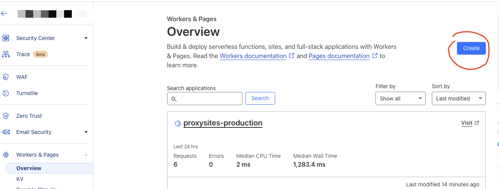
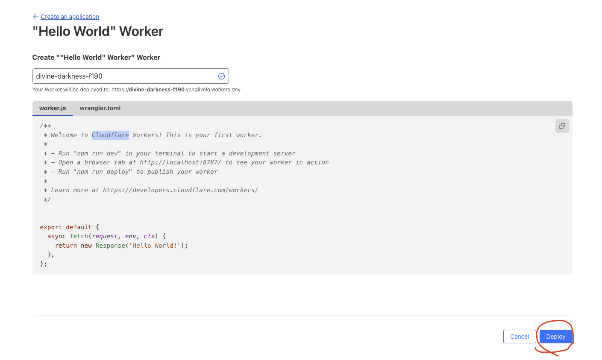
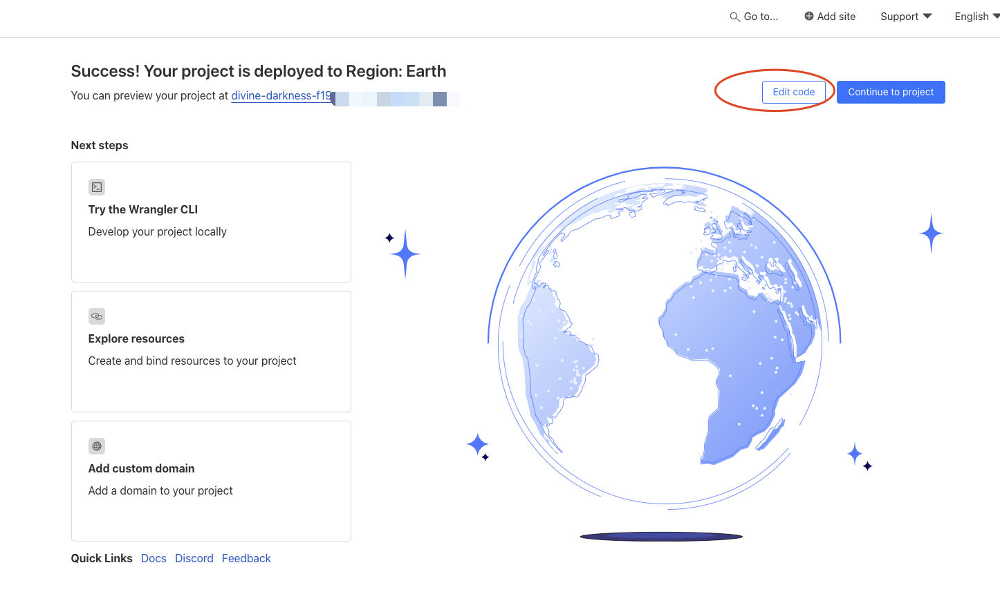
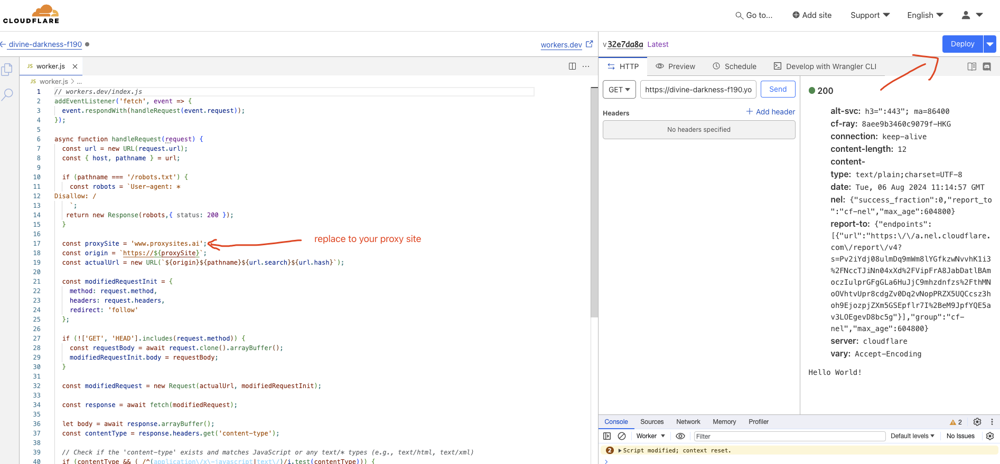
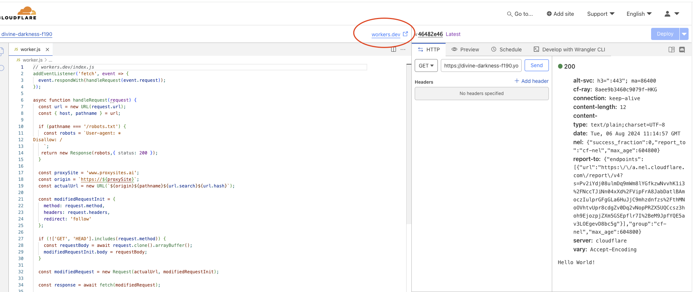

# Manual Cloudflare Setup

## 1. Open Workers & Pages




## 2. Create Worker


## 3. Deploy Worker




## 4. Edit Code




Copy your code to editor [workers.dev/index.js](index.js) or [index.js](../index.js)

### workers.dev/index.js

In this case, you will need change the code:

```js
// workers.dev/index.js
// replace to your proxy site domain
const proxySite = 'example.com';
```




## Done and Preview


